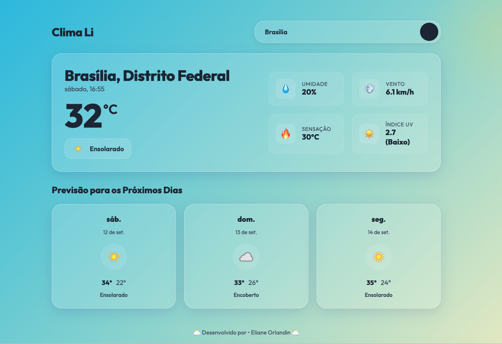

# Clima Li ⛅

Um aplicativo web de clima moderno que oferece previsões em tempo real, transições automáticas de dia/noite e animações dinâmicas de clima integradas a um proxy seguro para ocultar chaves de API.




---

## 🛠️ Tecnologias Utilizadas (Stack)


---

## ✨ Funcionalidades

- **Design Premium Glassmorphic**: Interface visual limpa, com efeitos de vidro fosco (backdrop-filter) e transições suaves.
- **Ciclo Climático de Boas-Vindas**: Na tela inicial, a atmosfera de fundo transiciona dinamicamente a cada 4 segundos entre vários climas (sol, noite estrelada, chuva com relâmpago, neve, nublado).
- **Pesquisa em Tempo Real**: Busque qualquer cidade do mundo para obter informações meteorológicas detalhadas.
- **Animações Atmosféricas**:
  - ✨ Estrelas piscantes para noites limpas.
  - 🌧️ Chuva caindo e simulação realista de trovões/relâmpagos para tempestades.
  - ❄️ Flocos de neve flutuando e oscilando para climas frios.
  - ☁️ Nuvens flutuantes que deslizam pela tela.
  - ☀️ Brilho solar pulsante para dias ensolarados.
- **Previsão de 3 dias**: Cards inferiores detalhando o clima e temperaturas máximas/mínimas para os próximos dias.
- **Backend Seguro (Proxy)**: Servidor Express intermediário que protege sua chave de acesso (API Key) do [WeatherAPI](https://www.weatherapi.com/) no ambiente servidor, impedindo-a de ser exposta no navegador.

---

## 🚀 Como Executar o Projeto Localmente

### 1. Clonar o Repositório
```bash
git clone https://github.com/Eliane-orlandin/clima-li.git
cd clima-li
```

### 2. Instalar Dependências
```bash
npm install
```

### 3. Configurar Chave de API
Crie um arquivo `.env` na raiz do diretório do projeto e adicione a sua chave da [WeatherAPI](https://www.weatherapi.com/):
```env
WEATHER_API_KEY=sua_chave_de_api_aqui
PORT=3000
```

### 4. Executar Servidor de Desenvolvimento
```bash
npm run dev
```

Isso iniciará simultaneamente:
- O backend Express na porta `3000` (`http://localhost:3000`)
- O frontend Vite com proxy ativo na porta `5173` (`http://localhost:5173`)

Abra seu navegador em **`http://localhost:5173`** e comece a navegar!

---

## 📁 Estrutura do Projeto

```text
├── .env                # Configurações de API (Não enviado ao Git)
├── .gitignore          # Regras para ignorar arquivos (node_modules, .env, etc.)
├── index.html          # Estrutura HTML do aplicativo
├── style.css           # Estilos globais, Glassmorphism e animações atmosféricas
├── main.js             # Lógica de interações do frontend e partículas
├── server.js           # Backend Proxy em Node.js + Express
├── package.json        # Dependências e scripts do npm
└── vite.config.js      # Configuração de proxy de desenvolvimento do Vite
```

---

Desenvolvido por **Eliane Orlandin** ⛅
